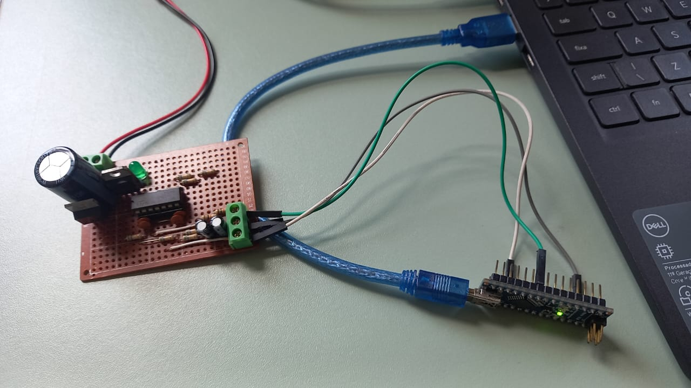

# Teoria de Sistemas Lineares (TSL)

Este repositório documenta as atividades, materiais de apoio e anotações referentes à disciplina de **Teoria de Sistemas Lineares**, ministrada no primeiro semestre de 2025.

---

## 📝 Anotações

Processo eletrônico subamortecido conectado a um PC usando sistema de aquisição de dados
baseado em Arduino:

**Códigos**:
 - [control_test.m](https://www.dropbox.com/scl/fo/jfhxgk939bcj9j1bv7h46/AGaA1JxgWRbU2PpQXD6CEw4/Aulas/Aula02e03e04e05e06?preview=control_test.m&rlkey=cxq7xpizvo950ml8dhoqop8m8&st=tdgjartd&dl=0)
- [system_ident](https://www.dropbox.com/scl/fo/jfhxgk939bcj9j1bv7h46/AGaA1JxgWRbU2PpQXD6CEw4/Aulas/Aula02e03e04e05e06?preview=system_ident.m&rlkey=cxq7xpizvo950ml8dhoqop8m8&st=1k9a5ppn&dl=0)